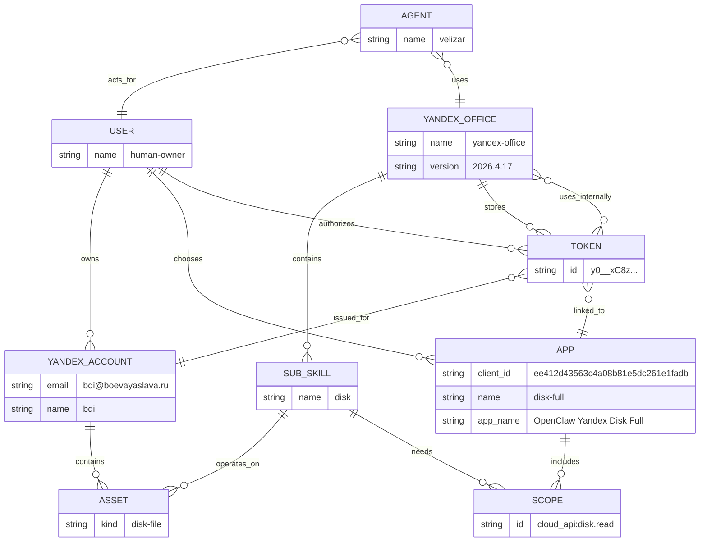

# Yandex Office Auth Guiding Principles

Status: draft guiding principles for `yandex-office` auth and onboarding design.

Purpose:
- define the core entities used across `yandex-office`
- keep onboarding, token storage, app selection, and permission diagnostics conceptually aligned
- keep Yandex OAuth scope modeling local to `yandex-office`
- keep the OpenClaw agent in the operational model as the executor that uses `yandex-office` on behalf of the user

## Core Entity Model

## Entity Definitions

- `user` is the real human owner of Yandex accounts and the authority behind authorization decisions.
- `agent` is the OpenClaw runtime actor, for example `velizar`; it performs tasks for and on behalf of the user.
- `yandex-office` is identified by `name` and `version`; the agent uses it to perform user-requested work.
- `yandex account` is identified by `email`; this is the Yandex account identity.
- `yandex account.name` is a local alias/handler used for commands and token filenames.
- `scope` is identified by `id`; this is a Yandex OAuth permission atom.
- `app` is identified by `client_id`; this is a Yandex OAuth application configured with a set of scopes.
- `sub-skill` is identified by `name`; this is valuable `yandex-office` functionality, for example `disk`.
- `token` is identified by the OAuth token value, for example `y0__xC8z...`; it is issued for a Yandex account and linked to the app that produced it.
- `asset` is data or capability owned through a Yandex account, for example a Disk file, mailbox message, calendar event, or Telemost conference.

## Relationship Definitions

- `user` owns `yandex account`: Yandex accounts belong to the human user, not to the OpenClaw agent.
- `agent` acts_for `user`: the agent is the delegated executor of user intent.
- `agent` uses `yandex-office`: the agent invokes `yandex-office` to perform work.
- `yandex account` contains `asset`: user assets are reachable through the Yandex account.
- `yandex-office` contains `sub-skill`: `yandex-office` is the package; sub-skills are its functional domains.
- `sub-skill` operates_on `asset`: sub-skills perform tasks on assets reachable through the user's account.
- `sub-skill` needs `scope`: a sub-skill function requires one or more OAuth permissions.
- `user` chooses `app`: the human user selects which OAuth app to authorize for the desired account/sub-skill outcome.
- `user` authorizes `token`: OAuth consent is granted by the user for a Yandex account.
- `token` issued_for `yandex account`: token verification binds the token to the verified Yandex account identity.
- `token` linked_to `app`: token verification returns the app `client_id`, linking the token to the selected/configured app.
- `yandex-office` stores `token`: after user authorization and verification, `yandex-office` persists the token for later use.
- `yandex-office` uses_internally `token`: `yandex-office` resolves and applies the token internally when a sub-skill calls a Yandex API.
- `app` includes `scope`: a Yandex OAuth app is configured with one or more permissions.

## Sanity Check

- The model separates the human authority (`user`), delegated executor (`agent`), `yandex-office`, and Yandex identity (`yandex account`).
- The agent is in the operational picture but is not the owner of Yandex accounts, apps, tokens, or assets.
- The model separates valuable functionality (`sub-skill`) from authorization mechanics (`scope`).
- The model separates an OAuth app (`app`) from the issued credential (`token`).
- The model keeps Yandex OAuth token storage and use inside `yandex-office`.
- The model supports multi-service apps because one app can include scopes needed by multiple sub-skills.
- The model does not require a local scope catalog forever; app metadata can be fetched by `client_id` when Yandex provides it.

## Token Handling Decision

The user authorizes the Yandex OAuth token.
`yandex-office` verifies the token, binds it to the verified Yandex account and OAuth app, stores it, and uses it internally for Yandex API calls.
The OpenClaw agent invokes `yandex-office`; it is not modeled as the token storage owner in this document.

Manual token paste through chat remains an accepted onboarding path for now.
This document does not define a separate OpenClaw secret-storage design for Yandex tokens.

## Design Principles

- Model Yandex OAuth `scope` explicitly because it is the lowest Yandex-native authorization atom.
- Do not expose scopes as the primary user-facing choice. Users choose Yandex accounts, sub-skills, and apps.
- Do not model a Yandex account as choosing an app. The user chooses the app and authorizes a token, and that token is linked to the OAuth app that produced it.
- Do not model the OpenClaw agent as the account owner or OAuth consent authority. The agent uses `yandex-office` to execute delegated user intent.
- Do model `yandex-office` as the component that stores, resolves, and uses Yandex OAuth tokens internally.
- Derive sub-skill coverage by comparing `app includes scope` with `sub-skill needs scope`.
- Treat token scopes as equivalent to the token app's scopes until proven otherwise.
- Use Yandex app metadata endpoints to avoid duplicating app names and scopes locally where possible.
- Use runtime API responses as final truth. Scopes guide onboarding and remediation; they must not become premature runtime blockers.
- Keep this model scoped to `yandex-office`; do not turn Yandex OAuth scopes into a universal OpenClaw auth abstraction.
- Keep Yandex account isolation orthogonal to scope modeling.
